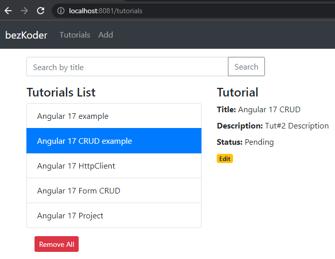

# Angular 17 example project: CRUD with Rest API

Build an Angular 17 CRUD example App to consume Rest APIs, display, modify & search data.

Tutorial Application in that:
- Each Tutorial has id, title, description, published status.
- We can create, retrieve, update, delete Tutorials.
- There is a Search bar for finding Tutorials by title.



## How to Run the Client Angular application

```
npm install
ng serve --port 8081
```

Navigate to http://localhost:8081/
